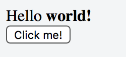

# Electron Workshop


Self preparation: https://electronjs.org

## Prerequisites

To work through this workshop's content you will need to **have installed** the following software:

* Node.js + npm: https://nodejs.org/en/ (environment to run JavaScript)
* (Optional) Yarn: https://yarnpkg.com/lang/en/docs/install/ (somewhat faster than npm)
* VSCode IDE: https://code.visualstudio.com/ (you can also use a different IDE, but recommended)
    * Node.js plugin for VSCode: https://marketplace.visualstudio.com/items?itemName=waderyan.nodejs-extension-pack
    * Better JS syntax highlight plugin for VSCode: https://marketplace.visualstudio.com/items?itemName=dzannotti.vscode-babel-coloring

## Workshop Contents

All issues to complete:

 * https://github.com/icanzilb/MockServerApp/issues

Create an issue in your own repo, and copy this markdown so you have a check list to work through:

```markdown
Here's a prioritized list of all available tasks.

The ones marked with [R] are required (e.g. you need to complete before moving on), and the ones marked as [O] are optional (you still have to do them, but they include a direct link to the solution).

- [ ] [R] [E001](https://github.com/icanzilb/MockServerApp/issues/1)  **Change app window title**
- [ ] [R] [C001](https://github.com/icanzilb/MockServerApp/issues/3) **Improve Table UI**
- [ ] [R] [N001](https://github.com/icanzilb/MockServerApp/issues/2) **Finish server code**
- [ ] [O] [E002](https://github.com/icanzilb/MockServerApp/issues/4) _Change status column width_
- [ ] [O] [J002](https://github.com/icanzilb/MockServerApp/issues/5) _Change UI for error rows_
- [ ] [O] [E003](https://github.com/icanzilb/MockServerApp/issues/6) _Finilize table UI_
- [ ] [R] [J003](https://github.com/icanzilb/MockServerApp/issues/7) **Display nr. of server requests**
- [ ] [R] [L001](https://github.com/icanzilb/MockServerApp/issues/8) **Display the server URL in the window**
- [ ] [R] [L002](https://github.com/icanzilb/MockServerApp/issues/9) **Open system web browser to view server URL**
- [ ] [R] [C002](https://github.com/icanzilb/MockServerApp/issues/10) **Add File button**
- [ ] [R] [L003](https://github.com/icanzilb/MockServerApp/issues/11) **Show system "Open File..." dialogue**
- [ ] [O] [L004](https://github.com/icanzilb/MockServerApp/issues/12) _Show popup confirmation_
- [ ] [O] [C005](https://github.com/icanzilb/MockServerApp/issues/13) _Add Minimize button_
- [ ] [R] [L005](https://github.com/icanzilb/MockServerApp/issues/14) **Show Tray icon**
- [ ] [R] [L006](https://github.com/icanzilb/MockServerApp/issues/15) **Show/hide app window**
- [ ] [O] [L007](https://github.com/icanzilb/MockServerApp/issues/16) _Build mac app bundle_
- [ ] [O] [LCE000](https://github.com/icanzilb/MockServerApp/issues/17) _Extra tasks (work on your own)_
```

## &raquo; HTML TLDR

HTML is a markup language describing a hierarchy of nodes which can be rendered in a web browser.

Here's few HTML elements, each can have content and/or child elements:

```html
<header>
  Hello <strong>world!</strong>
</header>
<span>
  <button>Click me!</button>
</span>
```

This renders in a web browser like so:



## &raquo; CSS TLDR

CSS is a descriptive language defining "classes" which you can assign to HTML elements to describe how they should be rendered.

Add a class property to an HTML element:

```html
<button class="myButton">Click me!</button>
```

And add css class with that name in a css file:

```css
.myButton {
  background: #efefef;
  border: 1px solid gray;
  color: green;
  font-size: 16px;
  font-family: Menlo;
  border-radius: 10px;
}
```

When the button is rendered in web browser it looks like this:


## &raquo; JavaScript TLDR

JavaScript is a programming language with simple syntax, which can run in a web browser, embedded in software apps, iOS, in standalone desktop apps, and more. Here's some basic language:

```JS
//local variable
let name = "Marin"

//local array
let names = [name, "Peter", "John"]

//declare function
function double(num) {
  return num * 2
}

//declare a class
class Hero extends Character {
  constructor(myType) {
    this.type = myType
  }
  
  getType() {
    return "is "+this.type
  }
}

//create object, call method
let me = new Hero("heroic")
alert(me.getType())

//passing anonymous function as parameter
ipcMain.on('test', (param1, param2)=>{
  // code block
})
```


## &raquo; React JSX

JSX is a templating feature of React.js which bundles a component's view code with the logic. The code between brackets is HTML to be rendered when the component is displayed in a web browser. Inside the HTML everything between curly brackets will be evaluated as JavaScript:

```JS
class App extends React.Component {
   constructor(props) {
    super(props)
    this.name = "World!"
   }
  
   render() {
      return (
         <div>
            Hello {this.name}
         </div>
      );
   }
}
```

